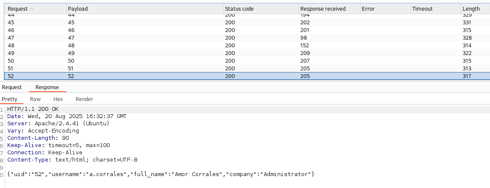
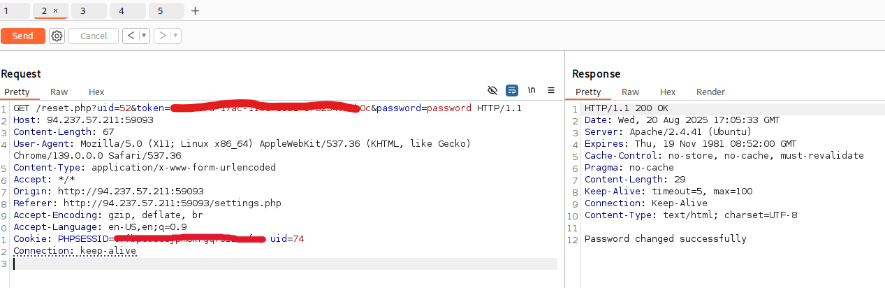
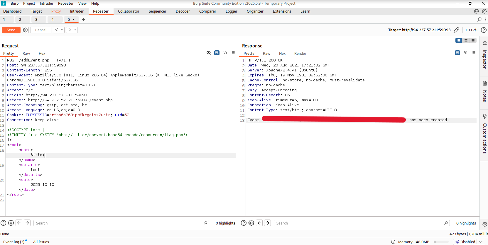

# Web Attacks – Case Study

**Author:** Jordan Davis  
**Platform:** Hack The Box Academy (Sanitized Case Study)  
**Category:** Web Exploitation / Multi-Vulnerability Chain  

---

## 🧠 Overview
This case study simulates a **web application penetration test** of a social networking platform.  
The objective was to enumerate, identify, and chain multiple vulnerabilities to escalate privileges and retrieve sensitive data.

The engagement demonstrated how a series of weaknesses — **IDOR, broken access control, insecure password reset, privilege escalation, and XXE injection** — can combine into a complete compromise.

---

## 🔑 Key Concepts
- Insecure Direct Object Reference (**IDOR**)  
- Broken Access Control  
- Password Reset Token Abuse → Account Takeover  
- Privilege Escalation via Admin Account  
- XML External Entity (**XXE**) Injection  
- `php://filter` Wrapper Exploitation  

---

## 🛠️ Tools & Techniques
- **Burp Suite** (Intruder, Repeater, Proxy)  
- **Custom XML Payloads** for XXE exploitation  
- **Base64 decoding** for source code exfiltration  
- **Parameter fuzzing & token manipulation**  

---

## 📝 Walkthrough

### **Stage 1 – IDOR Enumeration**
User profile data was accessible via predictable `uid` values.  
By fuzzing `uid`, multiple user records were enumerated.

---

### **Stage 2 – Password Reset Token Abuse**
Password reset tokens were exposed via a predictable endpoint.  
Tokens could be replayed with crafted requests to reset passwords for arbitrary users.  

---

### **Stage 3 – Privilege Escalation**
An administrative account was identified and compromised via token abuse.  
Admin privileges unlocked XML-based event creation functionality.

---

### **Stage 4 – XXE Injection**
The XML event handler was vulnerable to **XXE**, enabling arbitrary file read.  
By pivoting to `php://filter`, source code disclosure and sensitive file retrieval were achieved.

---

## 🧱 Challenges Faced
- Initial wasted effort fuzzing ineffective payloads.  
- Needed to pivot from direct file reads to wrapper-based exfiltration.  
- Password reset logic required precise manipulation.  

---

## 🛡️ Defense & Remediation
- **Access Control & IDOR:** Validate access server-side, use opaque identifiers.  
- **Password Resets:** Bind tokens to sessions, ensure tokens expire quickly, enforce rightful ownership.  
- **Privilege Management:** Strict RBAC with audit logging.  
- **XXE Mitigation:** Disable external entities, prefer JSON over XML.  

---

## 📊 Impact
- Sensitive data exposure (IDOR)  
- Arbitrary account takeover (reset token abuse)  
- Full administrative compromise  
- Arbitrary file read & source code disclosure  

---

## ✅ Conclusion
This case study highlights how **chained vulnerabilities escalate overall risk**.  
Individually minor issues compounded into:  
- IDOR → Account Takeover  
- Token Abuse → Admin Compromise  
- Admin → XXE → File Disclosure  

This mirrors real-world penetration tests, where layered weaknesses create critical business risk.

---

## 🔗 Author & Profiles
- **Author:** Jordan Davis  
- [GitHub Profile](https://github.com/jd-cybersec)  
- [LinkedIn Profile](https://www.linkedin.com/in/jordan-davis47/)
