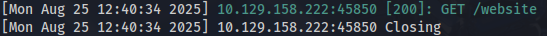
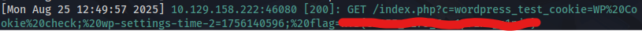

# Cross-Site Scripting (XSS) – Case Study

**Author:** Jordan Davis  
**Platform:** Hack The Box Academy (Sanitized Case Study)  
**Category:** Web Exploitation / XSS  

---

## 🧠 Overview  

This case study simulates a **web application penetration test** of a blogging platform.  
The objective was to identify a **Cross-Site Scripting (XSS)** vulnerability, attempt multiple payload variations, and escalate to **session hijacking of an administrative account**.  

The engagement demonstrated how a single unsanitized input can escalate into a critical compromise.  

---

## 🔑 Key Concepts  

- Cross-Site Scripting (**XSS**)  
- Payload crafting & bypass methodology  
- Stored XSS → Session hijacking chain  
- Cookie exfiltration via malicious JavaScript  
- Session replay for privilege escalation  
- Importance of contextual output encoding  

---

## 🛠️ Tools & Techniques  

- **Burp Suite** for request inspection and payload testing  
- **Custom XSS payloads** (inline, attribute-based, external scripts)  
- **PHP built-in server** (`php -S`) for exfiltration  
- **Cookie logger script (PHP)** for session capture  
- **Browser dev tools** for session replay  

---

## 📝 Walkthrough (Sanitized)  

### Stage 1 – Input Testing  
- Enumerated input fields in the blog’s comment section.  
- Found that the **website field** persisted into HTML without proper encoding.  
- Confirmed suspicious candidate for injection.  

### Stage 2 – Payload Attempts  
- Inline script injection blocked.  
- Event handler payloads encoded.  
- External script payload stored successfully → executed in victim browser.  

  

### Stage 3 – Weaponization  
- Crafted a malicious external JavaScript payload to exfiltrate cookies.  
- Deployed a PHP script to log cookie values from victim browsers.  
- Injected payload into vulnerable field.  

### Stage 4 – Exploitation  
- Admin viewed page → browser loaded malicious script.  
- Cookies were captured by attacker server.  

  

### Stage 5 – Session Hijacking  
- Imported captured session cookie into browser.  
- Gained authenticated Admin access without credentials.  

✅ **Confirmed account takeover via stolen cookie**.  

---

## 🧱 Challenges Faced  

- Initial payloads blocked by filters.  
- Pivot required: inline payload → attribute injection → external script.  
- Ensured cookie logging worked reliably.  

---

## 🛡️ Remediation & Defense  

- **Context-aware output encoding** (escape input per its usage context).  
- **Content Security Policy (CSP)** to block inline scripts.  
- **HttpOnly cookies** to prevent JavaScript access.  
- **Strict input validation** to allow only valid URLs.  
- **Automated security testing** to detect XSS during development.  

---

## 📊 Impact  

- Stored XSS via blog comment field.  
- Admin session hijacking → full account takeover.  
- Escalation from user → administrator privileges.  

---

## ✅ Conclusion  

This case study highlights how even a **basic stored XSS** can have critical impact when chained with session hijacking.  
Minor encoding flaws enabled a payload that compromised the **administrator account**, demonstrating the real-world severity of XSS.  

---

## 🔗 Author & Profiles  

- **Author:** Jordan Davis  
- [GitHub Profile](https://github.com/jd-cybersec)  
- [LinkedIn Profile](https://www.linkedin.com/in/jordan-davis47/)
